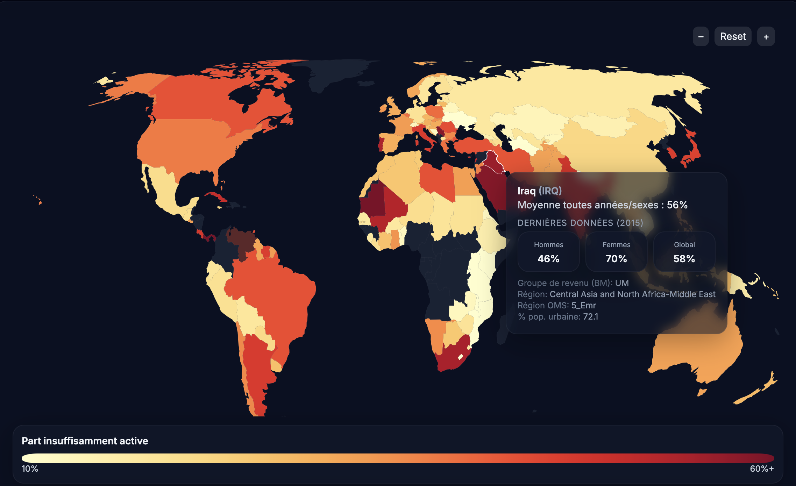

# Global Physical Inactivity Map

A fast, interactive web app to **explore global physical inactivity** by country — with male/female splits, regions, and contextual covariates. Built with **React + Vite**, **react-simple-maps (D3/TopoJSON)** and **Tailwind CSS**.



---
## Quick start

```bash
# 1) Install dependencies
npm install

# 2) Start the dev server
npm run dev

# 3) Build for production (static assets)
npm run build

# 4) Preview the production build locally
npm run preview
```

By default Vite prints a local URL for development (e.g. `http://localhost:5173`).

---

## What this does
- Choropleth world map with a country tooltip (latest WHO figures in the dataset).
- Quick zoom/reset and smooth map interactions.
- Filters by **sex**, **year** (where available), and **regions**.
- “Detailed filters / Explorer” page to slice the data (experimental).
- Covariates page: basic charts to explore associations using the provided CSVs.
- Lightweight build that you can deploy on any static host (GitHub Pages, Netlify, etc.).

> **Note on data**  
> The repository ships with CSV files in `public/data/` (see below). Replace them with your own exports if you maintain a newer dataset.

---

## ⚠️ Known limitations / bugs
- The **Detailed filters / Explorer** page is **experimental**. It’s usable, but you can sometimes create combinations that produce **nonsensical results** (e.g. countries with *100% inactivity*). That’s a logic edge case in the filter pipeline — not the underlying data.
- Country names/codes and region groupings may differ from other sources; they follow the dataset included here.
- Tooltips and labels are in **French** for now.

---

## Tech stack
- **React 18** with **Vite 5**
- **react-simple-maps** (+ D3, topojson-client)
- **Tailwind CSS** (+ PostCSS, Autoprefixer)
- **Framer Motion** and **lucide-react** for UI/animation
- **react-router-dom** for navigation

---

## Project structure (key parts)

```
public/
  data/
    pina_dataset.csv        # main dataset (physical inactivity, %)
    covariates.csv          # optional covariates
src/
  components/               # Map + UI components
  pages/                    # Home, Explorer, Covariates
  lib/                      # utils
  App.jsx, main.jsx, styles.css
vite.config.js
tailwind.config.cjs
postcss.config.cjs
```

---

## Prerequisites
- **Node.js 18+** (Vite 5 requires modern Node)  
- **npm** (or **pnpm**/**yarn** if you prefer)

---


## Configuration
No API keys are required. The app reads CSV files from `public/data/` at runtime.  
If you provide your own data:
- Keep the **column names** consistent with the current CSVs.
- For the map, the country identifier must match the **ISO A3** codes used by the TopoJSON.

---

## Data sources
- **Primary dataset**: adapted from the **PinA** repository by ML Global Health — [MLGlobalHealth/PinA › data](https://github.com/MLGlobalHealth/PinA/tree/main/data). CSV files in `public/data/` are derived from or compatible with that structure.

- WHO fact sheet and global estimates.  
- This repository includes **prepared CSVs** for convenience. If you use newer WHO data, replace `public/data/*.csv` and re-run the app.

**Important:** The map is a visualization tool; figures may differ from official dashboards depending on year/aggregation and preprocessing.

---

## Deployment
Any static host works:
- **GitHub Pages:** build (`npm run build`) then push `dist/` to Pages.  
- **Netlify/Vercel:** set build command to `npm run build` and publish directory to `dist/`.

---

## Development notes
Useful directories and files:
- `src/components/ChoroplethMap.jsx` – main map rendering.
- `src/pages/CovariatesPage.jsx` – covariates demo page.
- `src/pages` – the “Explorer” and other routes.
- `public/data/` – CSVs.

---

## Reporting issues
Bugs and small inconsistencies are expected on the “Detailed filters / Explorer” page. PRs welcome if you’d like to help harden the filter logic and guards.

---

## 📄 License
MIT

—
_Last updated: 2025-10-27_
